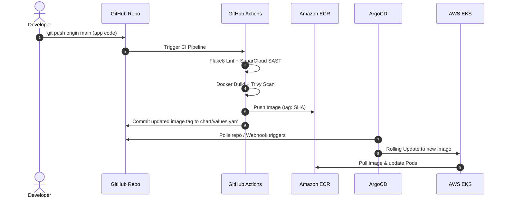

# Deploy a Python Application to AWS EKS using GitOps & DevSecOps

[](https://github.com/turkardiksha345-oss/aws-eks-gitops-pipeline/actions)
[](https://www.python.org/downloads/)
[](https://kubernetes.io/)
[](https://argo-cd.readthedocs.io/)
[](https://aws.amazon.com/eks/)
[](https://aquasecurity.github.io/trivy/)
[](https://opensource.org/licenses/MIT)

---

## 📌 Executive Summary & Objective

This repository contains a production-ready, enterprise-grade deployment pipeline for a containerized **Python Flask "Doodle Quote" Application** on **Amazon Elastic Kubernetes Service (EKS)** following **GitOps** principles.

The solution implements strict **DevSecOps** best practices throughout the lifecycle:
- Automated Static Application Security Testing (**SAST**) & linting.
- Vulnerability scanning of container images with **Trivy**.
- Short-lived credential authentication via **AWS IAM OIDC** (no hardcoded secrets).
- Continuous delivery and state reconciliation via **ArgoCD**.
- High availability, automated horizontal autoscaling (**HPA**), and self-healing.
- Secure internet exposure with **AWS Application Load Balancer (ALB)** and **SSL/TLS encryption** for both the application and ArgoCD UI under the `cdec-engineer.store` domain.
- 1-click **Rollback mechanisms** backed by Git history as the single source of truth.
- **Cost optimization controls** to stop/suspend non-production environments when not in use.

---

## 📑 Table of Contents

1. [Architecture & Workflow](#-architecture--workflow)
2. [DevSecOps Security Controls](#-devsecops-security-controls)
3. [Repository Structure](#-repository-structure)
4. [Deliverables Checklist](#-deliverables-checklist)
5. [Prerequisites & AWS Setup](#-prerequisites--aws-setup)
6. [Step-by-Step Deployment Guide](#-step-by-step-deployment-guide)
   - [1. Infrastructure & EKS Bootstrapping](#1-infrastructure--eks-bootstrapping)
   - [2. ECR & GitHub Actions OIDC Setup](#2-ecr--github-actions-oidc-setup)
   - [3. SSL/TLS Certificate Setup (ACM)](#3-ssltls-certificate-setup-acm)
   - [4. ArgoCD Installation & Configuration](#4-argocd-installation--configuration)
   - [5. Application Deployment via ArgoCD](#5-application-deployment-via-argocd)
7. [SSL/TLS & Domain Configuration (`cdec-engineer.store`)](#-ssltls--domain-configuration-cdec-engineerstore)
8. [Automated Deployment & Rollback Strategy](#-automated-deployment--rollback-strategy)
9. [Cost Optimization & Environment Suspension](#-cost-optimization--environment-suspension)
10. [Verification & Operational Runbook](#-verification--operational-runbook)

---

## 🏛 Architecture & Workflow

```
+----------------------------------------------------------------------------------------------------+
|                                      DEVELOPER & GITHUB WORKSPACE                                  |
|                                                                                                    |
|   +---------------+      git push       +------------------------------------------------------+   |
|   |   Developer   | -----------------> | GitHub Repository (turkardiksha345-oss/aws-eks-...)  |   |
|   +---------------+                    +------------------------------------------------------+   |
|                                                                   |                                |
|                                                                   | triggers                       |
|                                                                   v                                |
|   +--------------------------------------------------------------------------------------------+   |
|   |                            GITHUB ACTIONS CI/CD PIPELINE (DevSecOps)                       |   |
|   |                                                                                            |   |
|   |   [1. Flake8 Lint] --> [2. SonarCloud SAST] --> [3. Docker Build] --> [4. Trivy CVE Scan] |   |
|   |                                                                                |           |   |
|   |                                                                                v           |   |
|   |   [6. Commit New Tag to chart/values.yaml] <-- [5. Push to Amazon ECR (OIDC)] <+           |   |
|   +--------------------------------------------------------------------------------------------+   |
+-------------------------------------------------------------------|--------------------------------+
                                                                    |
                                        Auto Git Commit (Image Tag) |
                                                                    v
+----------------------------------------------------------------------------------------------------+
|                                           AWS CLOUD (EKS CLUSTER)                                  |
|                                                                                                    |
|   +--------------------------------------------------------------------------------------------+   |
|   |  ArgoCD Controller (Namespace: argocd)                                                     |   |
|   |  - Monitors Git repository chart/ directory                                                |   |
|   |  - Detects drift and synchronizes desired state with EKS                                  |   |
|   +--------------------------------------------------------------------------------------------+   |
|                                                |                                                   |
|                         Deploys / Updates      | Pulls Container Image                             |
|                                                v                                                   |
|                     +--------------------------------------+     +-----------------------------+   |
|                     | AWS EKS - Namespace: hello-world-app | <-- | Amazon ECR (Private)        |   |
|                     |                                      |     +-----------------------------+   |
|                     |  - Deployment (2-10 Replicas)        |                                       |   |
|                     |  - HPA (CPU / Memory target 80%)     |                                       |   |
|                     |  - ClusterIP Service                 |                                       |   |
|                     |  - Pod Security Context (Non-Root)   |                                       |   |
|                     +--------------------------------------+                                       |
|                                        ^                                                           |
|                                        | Routes Traffic (Target Group: IP Mode)                    |
|                     +--------------------------------------+                                       |
|                     | AWS Application Load Balancer (ALB)  |                                       |
|                     | Ingress Controller (HTTPS 443)       |                                       |
|                     +--------------------------------------+                                       |
|                                        ^                                                           |
|                     SSL/TLS Encrypted  | ACM Certificate: *.cdec-engineer.store                    |
+----------------------------------------|-----------------------------------------------------------+
                                         |
                       +------------------------------------+
                       |  https://app.cdec-engineer.store   |
                       |  https://argocd.cdec-engineer.store|
                       |  (End Users & Operators)           |
                       +------------------------------------+
```

---

## 🛡 DevSecOps Security Controls

| Phase | Security Tool / Control | Implementation Details |
| :--- | :--- | :--- |
| **Code Quality & Linting** | `flake8` | Analyzes code for syntax errors, undefined variables, and adherence to PEP 8. |
| **SAST (Static Testing)** | `SonarCloud` | Scans source code for potential vulnerabilities, bugs, security hotspots, and code smells. |
| **Container Hardening** | `Dockerfile (Non-Root)` | Creates an isolated `appuser` (UID: 1000) and drops all container root privileges. |
| **Image Vulnerability Scan** | `Aqua Trivy` | Scans container OS packages and Python dependencies for `CRITICAL` and `HIGH` CVEs before pushing to registry. |
| **AWS Authentication** | `GitHub OIDC (AssumeRoleWithWebIdentity)` | Eliminates long-lived AWS IAM access keys; temporary credentials are used via IAM Roles. |
| **Pod Security Standards** | `Kubernetes SecurityContext` | Enforces `runAsNonRoot: true`, drops all capabilities (`drop: ALL`), and restricts file system permissions. |
| **Network & Transport** | `AWS ACM + ALB Ingress` | Enforces HTTPS on port 443 with TLS 1.2+ and automatic HTTP-to-HTTPS redirection (`ssl-redirect: 443`). |

---

## 📁 Repository Structure

```tree
aws-eks-gitops-pipeline/
├── .github/
│   └── workflows/
│       └── ci.yml                 # GitHub Actions DevSecOps pipeline (Lint, SAST, Trivy, ECR, GitOps commit)
├── app/
│   ├── main.py                    # Python 3.11 Flask application with quote generator & /health probe
│   ├── requirements.txt           # Application dependencies (Flask, etc.)
│   ├── static/
│   │   └── css/
│   │       └── style.css          # Responsive styling
│   └── templates/
│       └── index.html             # UI template for Hello World Quote generator
├── argocd/
│   ├── application.yaml           # ArgoCD Application CRD (syncs Helm chart to EKS hello-world-app namespace)
│   └── argocd-ingress.yaml        # Ingress for ArgoCD UI exposed securely on argocd.cdec-engineer.store
├── chart/
│   ├── Chart.yaml                 # Helm Chart definition
│   ├── values.yaml                # Helm configuration values (Replica count, image, ALB annotations, HPA)
│   └── templates/
│       ├── _helpers.tpl           # Template helper definitions
│       ├── deployment.yaml        # Deployment manifest with liveness/readiness probes & securityContext
│       ├── service.yaml           # Kubernetes ClusterIP service
│       ├── ingress.yaml           # Ingress manifest leveraging AWS ALB controller & ACM SSL certificate
│       └── hpa.yaml               # HorizontalPodAutoscaler manifest (CPU/Memory scaling)
├── docs/
│   ├── architecture.md            # Comprehensive architecture documentation
│   └── operations.md              # Operational procedures (deployment, rollback, cost optimization)
├── terraform/                     # Infrastructure as Code (VPC, EKS, ECR, ACM, IAM OIDC roles)
│   ├── main.tf
│   ├── vpc.tf
│   ├── eks.tf
│   ├── ecr.tf
│   ├── iam.tf
│   ├── acm.tf
│   ├── variables.tf
│   ├── outputs.tf
│   └── terraform.tfvars.example
├── Dockerfile                     # Multi-stage/lean Python 3.11 container with non-root security user
├── .dockerignore                  # Files excluded from the build context
└── README.md                      # Complete project manual & runbook
```

---

## ✅ Deliverables Checklist

| Deliverable | Location in Repository | Status |
| :--- | :--- | :---: |
| **Python Sample Application** | [`app/main.py`](app/main.py) | ✅ Completed |
| **Source Code Repository** | GitHub / GitLab repository | ✅ Completed |
| **CI/CD & DevSecOps Pipeline** | [`.github/workflows/ci.yml`](.github/workflows/ci.yml) | ✅ Completed |
| **ArgoCD GitOps Manifests** | [`argocd/application.yaml`](argocd/application.yaml), [`argocd/argocd-ingress.yaml`](argocd/argocd-ingress.yaml) | ✅ Completed |
| **Kubernetes Helm Charts** | [`chart/`](chart/) (Deployment, Service, Ingress, HPA) | ✅ Completed |
| **SSL/TLS Configuration** | AWS ACM + Ingress annotations (`cdec-engineer.store`) | ✅ Completed |
| **Architecture Documentation** | [`docs/architecture.md`](docs/architecture.md) | ✅ Completed |
| **Operational & Rollback Runbook**| [`docs/operations.md`](docs/operations.md) | ✅ Completed |
| **Cost Optimization Plan** | Scale-to-Zero & ASG Suspension guide | ✅ Completed |

---

## 🛠 Prerequisites & AWS Setup

Before running the deployment, ensure you have:
1. **AWS CLI** (v2.x) configured with appropriate administrative credentials.
2. **`kubectl`** and **`helm`** (v3.x) installed locally.
3. An **Amazon EKS Cluster** (v1.28+) running.
4. **AWS Load Balancer Controller** installed on the EKS cluster.
5. Domain **`cdec-engineer.store`** managed in Route 53 (or external DNS with ability to create CNAME/Alias records).

---

## 🚀 Step-by-Step Deployment Guide

### 1. Infrastructure & EKS Bootstrapping

If you haven't created an EKS cluster yet, you can create one using `eksctl`:

```bash
# Create EKS Cluster
eksctl create cluster \
  --name eks-cluster \
  --region eu-north-1 \
  --nodegroup-name standard-workers \
  --node-type t3.medium \
  --nodes 2 \
  --nodes-min 2 \
  --nodes-max 4 \
  --managed

# Connect kubectl to cluster
aws eks update-kubeconfig --region eu-north-1 --name eks-cluster
```

#### Install AWS Load Balancer Controller
```bash
# Associate IAM OIDC Provider
eksctl utils associate-iam-oidc-provider --region=eu-north-1 --cluster=eks-cluster --approve

# Create IAM policy and Service Account for ALB Controller
curl -o iam_policy.json https://raw.githubusercontent.com/kubernetes-sigs/aws-load-balancer-controller/main/docs/install/iam_policy.json
aws iam create-policy --policy-name AWSLoadBalancerControllerIAMPolicy --policy-document file://iam_policy.json

eksctl create iamserviceaccount \
  --cluster=eks-cluster \
  --namespace=kube-system \
  --name=aws-load-balancer-controller \
  --role-name AmazonEKSLoadBalancerControllerRole \
  --attach-policy-arn=arn:aws:iam::<AWS_ACCOUNT_ID>:policy/AWSLoadBalancerControllerIAMPolicy \
  --approve

# Install Helm chart
helm repo add eks https://aws.github.io/eks-charts
helm repo update
helm install aws-load-balancer-controller eks/aws-load-balancer-controller \
  -n kube-system \
  --set clusterName=eks-cluster \
  --set serviceAccount.create=false \
  --set serviceAccount.name=aws-load-balancer-controller
```

---

### 2. ECR & GitHub Actions OIDC Setup

#### Create Amazon ECR Repository:
```bash
aws ecr create-repository \
  --repository-name aws-eks-gitops-pipeline \
  --image-scanning-configuration scanOnPush=true \
  --region us-east-1
```

#### Configure IAM Role for GitHub Actions (OIDC):
Create a trust policy `github-trust-policy.json`:
```json
{
  "Version": "2012-10-17",
  "Statement": [
    {
      "Effect": "Allow",
      "Principal": {
        "Federated": "arn:aws:iam::<AWS_ACCOUNT_ID>:oidc-provider/token.actions.githubusercontent.com"
      },
      "Action": "sts:AssumeRoleWithWebIdentity",
      "Condition": {
        "StringEquals": {
          "token.actions.githubusercontent.com:aud": "sts.amazonaws.com"
        },
        "StringLike": {
          "token.actions.githubusercontent.com:sub": "repo:turkardiksha345-oss/aws-eks-gitops-pipeline:*"
        }
      }
    }
  ]
}
```

```bash
# Create IAM Role and attach ECR access policy
aws iam create-role \
  --role-name github-actions-ecr-role \
  --assume-role-policy-document file://github-trust-policy.json

aws iam attach-role-policy \
  --role-name github-actions-ecr-role \
  --policy-arn arn:aws:iam::aws:policy/AmazonEC2ContainerRegistryPowerUser
```

Update your GitHub Repository Settings:
- Add `AWS_ROLE_TO_ASSUME`: `arn:aws:iam::<AWS_ACCOUNT_ID>:role/github-actions-ecr-role`
- Add `SONAR_TOKEN` (optional for SonarCloud SAST).

---

### 3. SSL/TLS Certificate Setup (ACM)

Request an AWS Certificate Manager (ACM) public certificate for `*.cdec-engineer.store` and `cdec-engineer.store`:

```bash
aws acm request-certificate \
  --domain-name "cdec-engineer.store" \
  --subject-alternative-names "*.cdec-engineer.store" \
  --validation-method DNS \
  --region us-east-1
```

> **DNS Verification Records:**
> ACM will generate CNAME records. Add these records to your DNS provider for domain validation:
>
> | Record Type | Name | Value | Purpose |
> | :--- | :--- | :--- | :--- |
> | **CNAME** | `_a7b8c...cdec-engineer.store` | `_x9y8z...acm-validations.aws.` | ACM SSL Validation |
>
> Once validated, copy the **Certificate ARN** (e.g., `arn:aws:acm:us-east-1:123456789012:certificate/abc-123`) and update `chart/values.yaml` and `argocd/argocd-ingress.yaml`.

---

### 4. ArgoCD Installation & Configuration

Install ArgoCD in the EKS cluster:

```bash
# Create namespace & install ArgoCD
kubectl create namespace argocd
kubectl apply -n argocd -f https://raw.githubusercontent.com/argoproj/argo-cd/stable/manifests/install.yaml

# Apply ArgoCD Ingress to expose UI over HTTPS with ALB
kubectl apply -f argocd/argocd-ingress.yaml

# Retrieve the initial admin password for ArgoCD UI
kubectl -n argocd get secret argocd-initial-admin-secret -o jsonpath="{.data.password}" | base64 -d; echo
```

---

### 5. Application Deployment via ArgoCD

Deploy the ArgoCD Application definition to begin continuous deployment:

```bash
kubectl apply -f argocd/application.yaml
```

ArgoCD will automatically:
1. Create the `hello-world-app` namespace.
2. Read the Helm chart in `chart/`.
3. Deploy the Deployment, Service, Ingress, and HPA.
4. Continuous reconciliation will keep the live state matched to Git.

---

## 🌐 SSL/TLS & Domain Configuration (`cdec-engineer.store`)

The solution provisions **AWS Application Load Balancers** via Kubernetes Ingress with ACM SSL termination.

### 1. Application Ingress (`app.cdec-engineer.store`)
Configured in [`chart/templates/ingress.yaml`](chart/templates/ingress.yaml) and [`chart/values.yaml`](chart/values.yaml):
- **Class:** `alb`
- **Scheme:** `internet-facing`
- **Port:** HTTP (80) & HTTPS (443)
- **Redirect:** Automatically forces HTTP to HTTPS (443)
- **Certificate:** Integrated with AWS Certificate Manager

### 2. ArgoCD Ingress (`argocd.cdec-engineer.store`)
Configured in [`argocd/argocd-ingress.yaml`](argocd/argocd-ingress.yaml):
- Provides secure TLS UI access for team operators at `https://argocd.cdec-engineer.store`.

### 3. DNS Records to Create
Once the Ingresses are created, retrieve their ALB DNS names:
```bash
# Application ALB Hostname
kubectl get ingress -n hello-world-app

# ArgoCD ALB Hostname
kubectl get ingress -n argocd
```

Create the following DNS records in the domain DNS management console:

| Subdomain | Record Type | Target / Value |
| :--- | :--- | :--- |
| `app.cdec-engineer.store` | **CNAME / Alias (A)** | `k8s-hellowor-xxx.us-east-1.elb.amazonaws.com` |
| `argocd.cdec-engineer.store` | **CNAME / Alias (A)** | `k8s-argocd-xxx.us-east-1.elb.amazonaws.com` |

---

## 🔄 Automated Deployment & Rollback Strategy

### Automated Deployment Workflow (GitOps)
1. Developer pushes code to `app/` on branch `main`.
2. GitHub Actions CI pipeline runs linting, SAST, builds Docker image, performs Trivy vulnerability scanning, and publishes the image tag `${{ github.sha }}` to Amazon ECR.
3. The CI job automatically updates `chart/values.yaml` with `tag: "<NEW_SHA>"` and commits back to Git with `[skip ci]`.
4. ArgoCD detects the new commit in Git and triggers an automated rolling update in the EKS cluster with zero downtime.



---

### Instant Rollback Strategy

Because Git is the **single source of truth**, rolling back a release is guaranteed, deterministic, and audited:

#### Method A: Git Revert (Recommended - Permanent & Audited)
```bash
# View recent commit history
git log --oneline -n 5

# Revert the bad commit that changed chart/values.yaml
git revert <BAD_COMMIT_SHA>
git push origin main
```
ArgoCD detects the revert within seconds and triggers a rollback on EKS to the previous stable container image.

#### Method B: ArgoCD UI / CLI 1-Click Rollback (Emergency)
```bash
# View deployment history
argocd app history aws-eks-gitops-pipeline

# Rollback to revision ID 2
argocd app rollback aws-eks-gitops-pipeline 2
```

---

## 💰 Cost Optimization & Environment Suspension

To minimize AWS cloud costs during non-business hours, testing pauses, or development downtimes, use the following operational procedures:

### Option 1: GitOps Workload Suspension (Scale to Zero)
Scale all workload pods down to 0 while keeping the EKS cluster and networking intact:

1. In `chart/values.yaml`, update:
```yaml
replicaCount: 0
autoscaling:
  enabled: false
```
2. Commit and push:
```bash
git commit -am "chore: suspend environment to reduce compute costs"
git push origin main
```
3. ArgoCD scales all application Pods to 0. ALB ceases routing traffic and compute utilization drops to baseline.

**To resume:** Revert the commit and push.

---

### Option 2: Full Cluster Node Pool Stop / Resume
To completely eliminate EC2 worker node costs during off-hours:

```bash
# Suspend EC2 Worker Nodes (Scale Node Group to 0)
aws eks update-nodegroup-config \
  --cluster-name eks-cluster \
  --nodegroup-name standard-workers \
  --scaling-config minSize=0,maxSize=0,desiredSize=0

# Disable ALB public ingress traffic (Optional)
kubectl annotate ingress aws-eks-gitops-pipeline -n hello-world-app \
  alb.ingress.kubernetes.io/inbound-cidrs='127.0.0.1/32' --overwrite
```

**Resume Environment:**
```bash
# Scale Node Group back up
aws eks update-nodegroup-config \
  --cluster-name eks-cluster \
  --nodegroup-name standard-workers \
  --scaling-config minSize=2,maxSize=4,desiredSize=2

# Re-enable public traffic
kubectl annotate ingress aws-eks-gitops-pipeline -n hello-world-app \
  alb.ingress.kubernetes.io/inbound-cidrs='0.0.0.0/0' --overwrite
```

---

## 🔍 Verification & Operational Runbook

### 1. Verify Pods & Health Status
```bash
kubectl get pods -n hello-world-app -o wide
kubectl logs -l app.kubernetes.io/name=aws-eks-gitops-pipeline -n hello-world-app --tail=50
```

### 2. Verify Health Check Endpoint
```bash
# Test internal health endpoint
kubectl run curl-test --image=curlimages/curl -i --rm --restart=Never -- \
  curl -s http://aws-eks-gitops-pipeline.hello-world-app.svc.cluster.local/health
# Response: {"status": "healthy"}
```

### 3. Verify SSL/TLS Certificate & HTTPS Ingress
```bash
# Verify SSL certificate on domain
curl -Iv https://app.cdec-engineer.store/health
curl -Iv https://argocd.cdec-engineer.store/healthz
```

### 4. Verify Autoscaling (HPA)
```bash
kubectl get hpa -n hello-world-app
```

---

## 📄 License

This project is licensed under the MIT License - see the [LICENSE](LICENSE) file for details.
